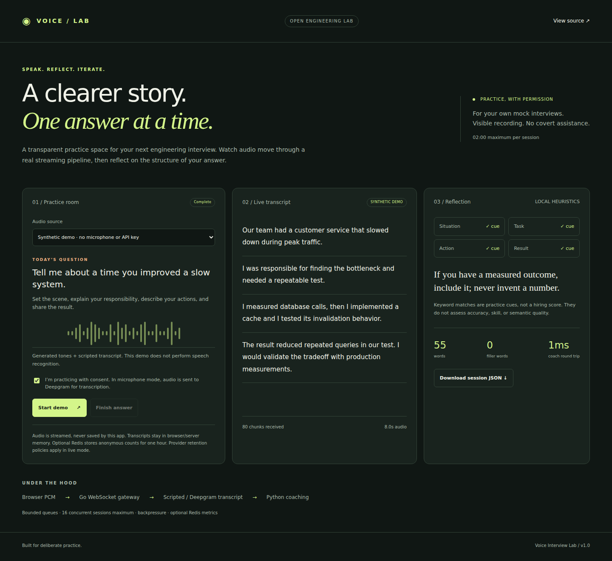
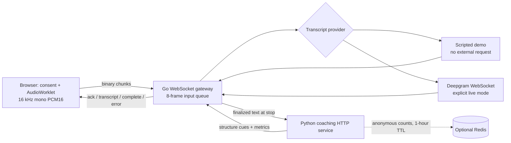

# Voice Interview Lab

**Practice an engineering interview. Inspect the streaming system behind it.**

[](https://github.com/dileepreddy27/voice-interview-lab/actions/workflows/ci.yml)

A consent-based mock-interview workspace with a Go WebSocket audio gateway, a Python coaching service, optional Deepgram streaming transcription, and optional Redis metrics. The credential-free demo runs the complete browser → gateway → coaching → dashboard loop.

This is a portfolio engineering lab for **disclosed practice**, with visible recording and a two-minute limit. It has no hidden overlay, system-audio interception, or covert interview assistance.



*Captured by the passing Chromium acceptance test, using the running Go and Python services. [Mobile view](docs/images/mobile.png).*

## Try the demo

Requirements: **Go 1.24+ and Python 3.11+**. No API key or Python dependency is needed for the native demo. First Go build downloads the single WebSocket dependency.

```sh
git clone https://github.com/dileepreddy27/voice-interview-lab.git
cd voice-interview-lab
python -m coach.service
```

In a second terminal in the same directory:

```sh
go run ./cmd/gateway
```

Open **http://127.0.0.1:8080**, check the consent box, and select **Start demo**. After eight seconds, inspect four scripted transcript segments, structure cues, audio counters, and a measured coaching round trip. Download the session JSON if you want a local copy.

**Demo disclosure:** the browser generates 220 Hz PCM tones. Transcript segments are scripted and released at audio-byte thresholds. This proves transport and orchestration, **not speech recognition**. Demo speaking pace is artificial. All included fixture text and generated tones are original to this project.

Alternatively, with a running Docker engine:

```sh
docker compose up --build
```

This includes Redis on an internal network. Only the gateway is published, on loopback. Stop with `docker compose down`.

## Why this exists

Audio applications need more than a microphone button: binary framing, concurrent provider events, stream finalization, downstream deadlines, bounded memory, and understandable failure states. Voice Interview Lab makes those boundaries visible while keeping the product small enough to run locally.

The coaching engine finds explicit Situation / Task / Action / Result keywords, counts words and a small filler-word vocabulary, and suggests a next practice step. It is deterministic and auditable. It is not an LLM, a semantic evaluator, or a hiring score.

## Architecture



| Component | Implemented behavior |
|---|---|
| Go + Gorilla WebSocket | One reader and one session writer per client; audio/control frames multiplexed with transcript and telemetry events; 16-session admission cap |
| Browser JavaScript | AudioWorklet capture, 100 ms PCM chunks, explicit permission, outstanding-frame cap, responsive dashboard, local JSON export |
| Python standard library | Validated HTTP contract; deterministic feedback; downstream failure isolated from audio transport |
| Deepgram | Server-side key, live PCM forwarding, interim/final parsing, CloseStream drain; tested against a mock WebSocket provider |
| Redis | Optional anonymous aggregate metrics, 3600-second expiry, graceful unavailable status; no transcript/audio storage |
| OpenAI Realtime | **Not implemented.** A possible future conversational interviewer, separate from the reproducible local coaching path |

See [protocol and lifecycle](docs/protocol.md) for message examples, bounds, and timing semantics.

## Optional live microphone

Set `DEEPGRAM_API_KEY` **in the gateway process environment**, then restart the gateway. The browser never receives the key. For example, use your local secret manager or shell environment; do not commit a key or paste it into the UI.

The microphone option becomes available only when the server has a nonempty key. Availability is not a credential validation check. A bad key or unavailable provider yields a visible error; there is no silent fallback to synthetic text. The microphone requires localhost or HTTPS and a browser supporting AudioWorklet at 16 kHz. Live mode sends audio to Deepgram, which may incur charges and has its own retention policy. No paid call is needed for demo or CI.

The adapter follows the [Deepgram streaming API](https://developers.deepgram.com/reference/speech-to-text/listen-streaming): `linear16`, mono, `sample_rate=16000`, interim results, and `CloseStream` to finish. Live accuracy, latency, and provider compatibility have **not been measured with a real API key**.

| Environment | Default | Purpose |
|---|---|---|
| `GATEWAY_ADDR` | `127.0.0.1:8080` | Local gateway listener |
| `COACH_URL` | `http://127.0.0.1:8091` | Internal coaching address |
| `COACH_BIND` / `COACH_PORT` | `127.0.0.1` / `8091` | Python listener |
| `DEEPGRAM_API_KEY` | absent | Enables live mode; server-side only |
| `REDIS_URL` | absent | Optional metric storage; install `requirements.txt` first |

## Verification

```sh
go vet ./...
go test -race -cover ./...
python -m unittest discover -s coach -v
node --check web/app.js
node --check web/pcm-worklet.js
python -m pip install -r requirements-dev.txt
# With native services or Compose running:
python scripts/smoke.py
```

The smoke client sends 80 chunks / 256,000 bytes, asserts ordered acknowledgements, four final segments, eight seconds of represented audio, and the real Python engine response. It sends faster than real time for a repeatable integration check. Its wall time is **not** a live-ASR latency benchmark.

Tests cover consent and source validation, missing credentials, malformed/oversized audio, cross-origin rejection, session capacity/release, provider wire events, complete demo orchestration, coaching outages, and feedback validation. CI additionally checks the Go race detector, real Redis TTL/field storage, and a built Docker Compose stack. See [verification evidence](docs/verification.md) for measured results and unverified boundaries.

## Design choices and limitations

- **Bounded sessions:** 120 seconds of audio, 32 KB maximum frame, 24,000-byte accumulated transcript cap, 8 queued input frames, and 16 queued provider events. A slow client encounters a three-second write deadline; browser capture stops at 20 unacknowledged chunks. This is a bounded prototype, not a high-throughput claim.
- **Finalization matters:** final text is evaluated only after the provider finishes. Deepgram has a five-second drain window; a missing completion becomes an error rather than a silently incomplete coaching result.
- **Explicit privacy boundary:** audio and text are held in memory, not logged or persisted by the application. Browser export is user-initiated and includes the transcript. Redis holds word/filler/pace counts only, under random keys, for one hour. Deepgram has separate policies.
- **Local deployment:** no account system, billing, distributed quota, production TLS termination, or hardening of the Python development HTTP server. Same-origin checking reduces browser cross-site requests; it is not authentication. Do not expose these services publicly as-is.
- **Coaching limitations:** English keyword rules can miss paraphrases and match negations. Pace includes silence. Worklet stop can discard a partial chunk (under 100 ms). No ASR word-error-rate study, multilingual coaching, measured concurrent-session load test, or production SLO is claimed.
- **No automatic reconnect:** restarting capture creates a fresh session to avoid duplicate transcript segments or ambiguous audio replay.

## Roadmap

- Add a consent-based OpenAI Realtime interviewer with a separate provider contract and mocked event tests.
- Measure provider latency and word error rate with a licensed speech corpus and disclosed hardware/network conditions.
- Add graceful server shutdown, authenticated sessions, distributed rate limits, and deployment-specific retention controls before public hosting.
- Replace keyword signals with an optional rubric-based model evaluation, retaining evidence and uncertainty in every result.

## Resume-ready highlights

- Built a Go/Python mock-interview streaming application with binary WebSocket audio, bounded queues, consent-gated browser capture, and deterministic coaching.
- Implemented a Deepgram streaming adapter with mocked protocol tests and optional Redis metrics with expiry; added integration checks for the credential-free audio-to-dashboard flow.

MIT licensed. See [LICENSE](LICENSE).
